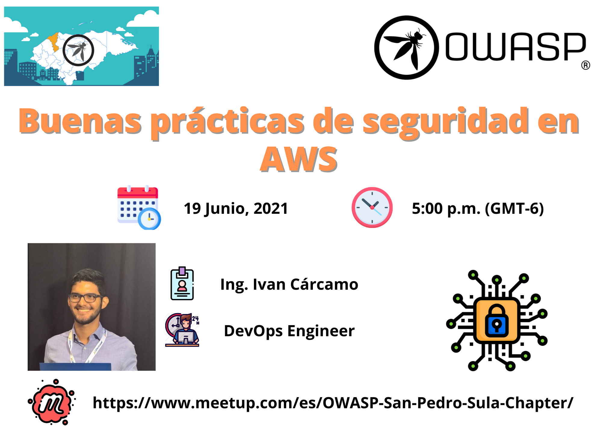
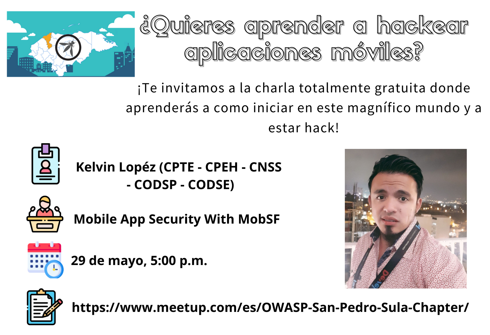
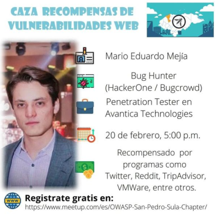
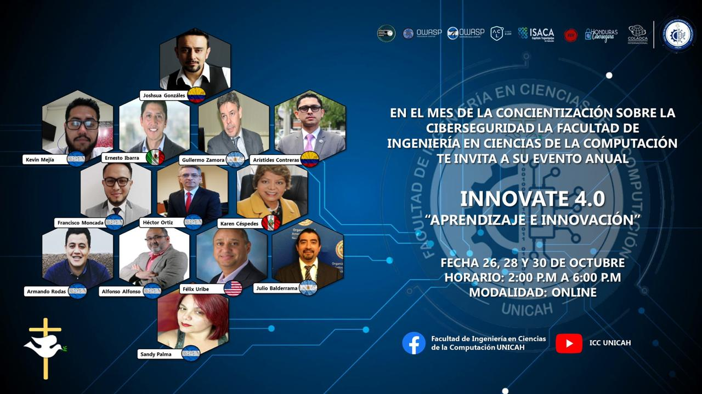

---

title: eventos
displaytext: Eventos
layout: col-sidebar
tab: true
order: 1
tags: OwasSPS

---
## Eventos 2021
### Buenas prácticas de Seguridad en AWS
 

  

 
<b>¿Quieres conocer sobre las buenas prácticas de seguridad en AWS?</b>
 
Ivan Cárcamo quien es DevOps Engineer nos explicará en su charla titulada "Buenas prácticas de Seguridad en AWS" sobre las mejores prácticas adoptadas por la industria.
 
<table width="100%" border="1" style="text-align:center;">
  <tr>
    <th width="10%">Hora</th>
    <th width="18%">Fecha</th>
     <th width="18%">Expositor</th>
     <th width="20%">Título Charla</th>
     <th width="18%">Grabación</th>
  </tr>
  <tr>
    <td>17:00-18:00</td>
    <td>Sabado 19 de junio</td>
    <td><b>Ivan Cárcamo</b></td>
    <td>Buenas prácticas de Seguridad en AWS</td>
    <td>https://drive.google.com/file/d/1wvTXoFd-T5YlQOii5Y-CozwQ_NmnoUcR/view</td>
  </tr>
</table>
 
 

  

 
<b>¿Quieres aprender como hackear aplicaciones móviles?</b>
 
Kelvin López quien es Consultor en Ciberseguridad  nos enseñara a como realizar un análisis de vulnerabilidades estático y dinámico a aplicaciones móviles.
 
<table width="100%" border="1" style="text-align:center;">
  <tr>
    <th width="10%">Hora</th>
    <th width="18%">Fecha</th>
     <th width="18%">Expositor</th>
     <th width="20%">Título Charla</th>
     <th width="18%">Link Registro</th>
  </tr>
  <tr>
    <td>17:00-18:00</td>
    <td>Sabado 29 de Mayo</td>
    <td><b>Kelvin López</b></td>
    <td>Mobile App Security With MobSF</td>
    <td>[Meetup](https://www.meetup.com/es/OWASP-San-Pedro-Sula-Chapter/)</td>
  </tr>
</table>
 
### Caza Recompensas de Vulnerabilidades Web
 

  

 
<b>¿Quieres aprender como ganar dinero hackeando éticamente?</b>
 
Esta es tu oportunidad, Mario Mejía quien es Bug Hunter y Penetration Tester nos contará en su charla titulada “Caza Recompensas de Vulnerabilidades Web”. Ha reportado fallos de seguridad a través de HackerOne y Bugcrowd a programas como lo son: Twitter, Reddit, TripAdvisor, Zilliqa, y VMWare, entre otros.
 
<table width="100%" border="1" style="text-align:center;">
  <tr>
    <th width="10%">Hora</th>
    <th width="18%">Fecha</th>
     <th width="18%">Expositor</th>
     <th width="20%">Título Charla</th>
     <th width="18%">Link Registro</th>
  </tr>
  <tr>
    <td>17:00-18:00</td>
    <td>Sabado 20 de Febrero</td>
    <td><b>Mario Mejía</b></td>
    <td>Caza Recompensas de Vulnerabilidades Web</td>
    <td>[Meetup](https://www.meetup.com/es/OWASP-San-Pedro-Sula-Chapter/)</td>
  </tr>
</table>
 

## Eventos 2020
 
### INNOVATE 4.0 "APRENDIZAJE E INNOVACIÓN"
En el mes de la concientización sobre la ciberseguridad apoyaremos a la facultad de ingeniería en ciencias de la computación a su evento anual INNOVATE 4.O "Aprendizaje e Innovación".

   

 
<table width="100%" border="1" style="text-align:center;">
  <tr>
    <th width="18%">Panel</th>
    <th width="18%">OWASP San Pedro Sula</th>
    <th width="18%">OWASP Tegucigalpa</th>
    <th width="18%">OWASP Tegucigalpa</th>
     <th width="18%">OWASP Tegucigalpa</th>
  </tr>
  <tr>
    <td>OWASP Honduras</td>
    <td>Armando Reniery Rodas</td>
    <td>Kevin Mejía</td>
    <td>Francisco Moncada</td>
  </tr>
</table>
 
<table width="100%" border="1" style="text-align:center;">
  <tr>
    <th width="15%">Fecha</th>
    <th width="15%">Hora</th>
    <th width="15%">Modalidad</th>
    <th width="15%">Youtube</th>
    <th width="15%">Facebook</th>
  </tr>
  
   ### Datos del Evento: 
  <tr>
    <td>26 de octubre</td>
    <td>02:00pm Hora Honduras</td>
    <td>Transmisión en vivo</td>
    <td>https://bit.ly/2GOWVCa</td>
    <td>https://bit.ly/2IgpOrB</td>
  </tr>
</table>
 

### Taller de Ethical Hacking y Ciberseguridad
 

   

Durante el mes de julio del 2020, aportaremos a la comunidad de estudiantes del Centro Universitario Tecnológico (CEUTEC) con una serie de talleres que tienen como objeto el apoyo en su desarrollo profesional.
 
<table width="100%" border="1" style="text-align:center;">
  <tr>
    <th width="10%">Horas</th>
    <th width="18%">Sabado 4</th>
    <th width="18%">Sabado 11</th>
    <th width="18%">Sabado 18</th>
    <th width="18%">Sabado 25</th>
  </tr>
  <tr>
    <td>18:00-21:00</td>
    <td><b>Kevin Mejía</b>: Explotación de vulnerabilidades en entornos Windows y Linux </td>
    <td><b>Raúl Aguilar</b>: Introducción a la ciberseguridad y gestión de vulnerabilidades</td>
    <td><b>Gerardo Gomez</b>: Web Hacking 101</td>
    <td><b>Armando Rodas</b>: Mobile Hacking 101</td>
  </tr>
</table>
 
### OWASP LATAM at HOME 2020
 

  

 
Durante la gira de [OWASP LATAM at Home 2020](https://owasp.org/www-event-2020-latam-at-home/) participamos como capítulo de Latinoamérica, con las siguientes conferencias:
 
<table width="100%" border="1" style="text-align:center;">
  <tr>
    <th width="10%">Horas</th>
    <th width="18%">Lunes 4</th>
    <th width="18%">Martes 5</th>
    <th width="18%">Miércoles 6</th>
    <th width="18%">Jueves 7</th>
    <th width="18%">Viernes 8</th>
  </tr>
  <tr>
    <td>18:40-19:20</td>
    <td>-</td>
    <td>-</td>
    <td><b>Raúl Aguilar</b>: Security Knowledge Framework</td>
    <td>-</td>
    <td>-</td>
  </tr>
  <tr>
    <td>19:20-20:00</td>
    <td>-</td>
    <td>-</td>
    <td><b>Armando Rodas</b>: OSINT, Técnicas de Reconocimiento en un Test de Intrusión</td>
    <td>-</td>
    <td>-</td>
  </tr>
</table>
 
   
## Eventos 2019
### Semana de Ingeniería CEUTEC (Centro Universitario Tecnológico)
 

Durante la semana de ingeniería celebrada por el Centro Universitario Tecnológico (CEUTEC) se realizaron la siguiente charla y taller.
 
<table width="100%" border="1" style="text-align:center;">
  <tr>
    <th width="10%">Horas</th>
    <th width="18%">Sabado 4</th>
    <th width="18%">Sabado 4</th>
  </tr>
  <tr>
    <td>13:00-19:00</td>
    <td><b>Raúl Aguilar</b>: -</td>
    <td><b>Armando Rodas</b>: -</td>
  </tr>
</table>
 
### Semana de ingeniería UTH (Universidad tecnológica de Honduras)
 

Durante la semana de ingeniería celebrada por la Universidad Tecnológica de Honduras se realizaron la siguiente charla y taller.
 
<table width="100%" border="1" style="text-align:center;">
  <tr>
    <th width="10%">Horas</th>
    <th width="18%">Sabado 4</th>
  </tr>
  <tr>
    <td>18:00-19:30</td>
    <td><b>Armando Rodas</b>: OWASP Top 10</td>
  </tr>
</table>
 
### OWASP LatamTour 2019
  
