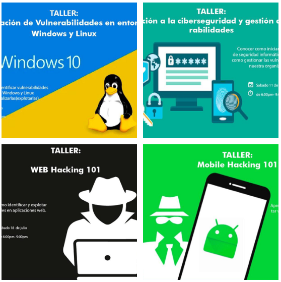
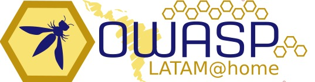

---

title: eventos
displaytext: Eventos
layout: col-sidebar
tab: true
order: 1
tags: OwasSPS

---
## Eventos 2020

 
### Taller de Ethical Hacking y Ciberseguridad
 

   

Durante el mes de julio del 2020, aportaremos a la comunidad de estudiantes del Centro Universitario Tecnológico (CEUTEC) con una serie de talleres que tienen como objeto el apoyo en su desarrollo profesional.
 
<table width="100%" border="1" style="text-align:center;">
  <tr>
    <th width="10%">Horas</th>
    <th width="18%">Sabado 4</th>
    <th width="18%">Sabado 11</th>
    <th width="18%">Sabado 18</th>
    <th width="18%">Sabado 25</th>
  </tr>
  <tr>
    <td>18:00-21:00</td>
    <td><b>Kevin Mejía</b>: Explotación de vulnerabilidades en entornos Windows y Linux</td>
    <td><b>Raúl Aguilar</b>: Introducción a la ciberseguridad y gestión de vulnerabilidades</td>
    <td><b>Gerardo Gomez</b>: Web Hacking 101</td>
    <td><b>Armando Rodas</b>: Mobile Hacking 101</td>
  </tr>
</table>
 
### OWASP LATAM at HOME 2020
 

  

 
Durante la gira de [OWASP LATAM at Home 2020](https://owasp.org/www-event-2020-latam-at-home/) participamos como capítulo de Latinoamérica, con las siguientes conferencias:
 
<table width="100%" border="1" style="text-align:center;">
  <tr>
    <th width="10%">Horas</th>
    <th width="18%">Lunes 4</th>
    <th width="18%">Martes 5</th>
    <th width="18%">Miércoles 6</th>
    <th width="18%">Jueves 7</th>
    <th width="18%">Viernes 8</th>
  </tr>
  <tr>
    <td>18:40-19:20</td>
    <td>-</td>
    <td>-</td>
    <td><b>Raúl Aguilar</b>: Security Knowledge Framework</td>
    <td>-</td>
    <td>-</td>
  </tr>
  <tr>
    <td>19:20-20:00</td>
    <td>-</td>
    <td>-</td>
    <td><b>Armando Rodas</b>: OSINT, Técnicas de Reconocimiento en un Test de Intrusión</td>
    <td>-</td>
    <td>-</td>
  </tr>
</table>
 
   
## Eventos 2019
### Semana de Ingeniería CEUTEC (Centro Universitario Tecnológico)
 

Durante la semana de ingeniería celebrada por el Centro Universitario Tecnológico (CEUTEC) se realizaron la siguiente charla y taller.
 
<table width="100%" border="1" style="text-align:center;">
  <tr>
    <th width="10%">Horas</th>
    <th width="18%">Sabado 4</th>
    <th width="18%">Sabado 4</th>
  </tr>
  <tr>
    <td>13:00-19:00</td>
    <td><b>Raúl Aguilar</b>: -</td>
    <td><b>Armando Rodas</b>: -</td>
  </tr>
</table>
 
### Semana de ingeniería UTH (Universidad tecnológica de Honduras)
 

Durante la semana de ingeniería celebrada por la Universidad Tecnológica de Honduras se realizaron la siguiente charla y taller.
 
<table width="100%" border="1" style="text-align:center;">
  <tr>
    <th width="10%">Horas</th>
    <th width="18%">Sabado 4</th>
  </tr>
  <tr>
    <td>18:00-19:30</td>
    <td><b>Armando Rodas</b>: OWASP Top 10</td>
  </tr>
</table>
 
### OWASP LatamTour 2019
  
